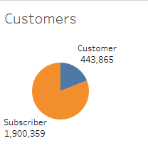
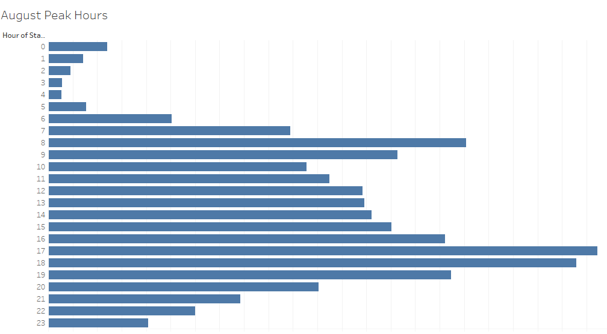

# Bikesharing Analysis

## Overview of the statistical analysis:

This analysis is done on the August 2019 data from Citibike, a company operating in the city of New York, to find out about different trends that may impact a similar business that wants to open up a bike sharing business. The data available is analyzed from different angle based on hours of operation, gender, time duration, location etc to provide a better understanding of the trends. Tableau was used to analyze the trends. The visualization can be found at the below link:

<a href='https://public.tableau.com/profile/samiul3383#!/vizhome/BikesharingVisualization/CitiBikeStory'>Bikeshare Visualization</a>

## Results:

The main visualizations created are as follows:

1. Checkout Times for Users: This shows the length of time that bikes are checked out for all riders. The initial bike trip is always the longest, as people need to figure and test out the bike workings.

</img>

2. Checkout Times by Gender: Following on from the previous visualization, only broken out by gender. 

</img>

3. Trips by Weekday Per Hour: Show the number of bike trips by weekday for each hour of the day as a heatmap. This helps in identifying the busiest hours of the days.

</img>

4. Trips by Gender (Weekday per Hour): Following on from the previous visualization, only broken out by gender.

</img>

5. User Trips by Gender by Weekday:  The number of bike trips by gender for each hour for each day of the week as a heatmap. This shows which days are the busiest and also broken down by gender.

</img>

6. Biking Map: This shows the popular starting points for citibike bike sharing.

</img>

7. Bike Utilization: This shows  the percentage of bikes being utilized in relation to other bikes.

</img>

## Summary:

Overall, given the data, it seems male customers are more used to riding during the weekdays and weekends, and the popular time seems to be the office starting(8-9) and ending hours(5-6) as this seems to be a popular mode of transport.

Some other visualization that can also be shown can be:

- The customer mix to see what type of customers the business gets

</img>

- The peak hours with number of trips per hour as a whole:

</img>